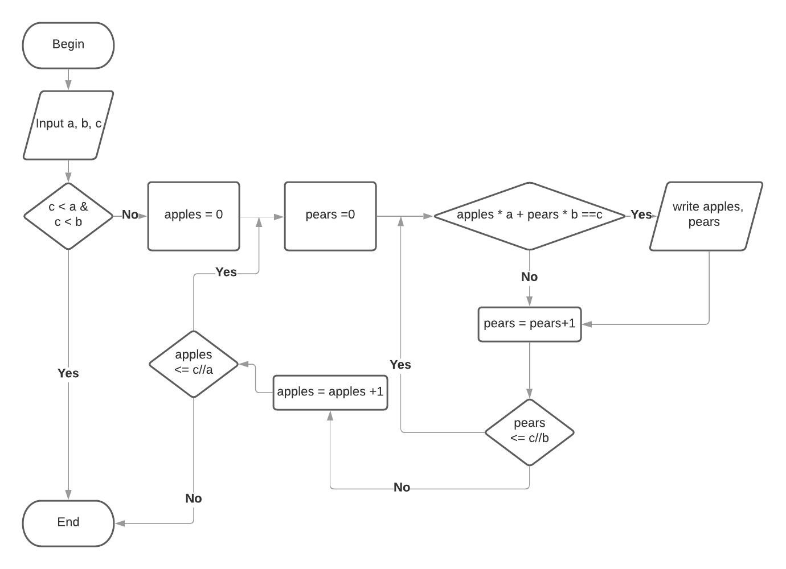

```{r setup, include=FALSE}
knitr::opts_chunk$set(echo = TRUE,message = F, warning = F, tidy = T)
```

# Задание 1

Диаграмма алгоритма:




Реализация алгоритма:

```{r}
f = function(a,b,c){
  if(a>c & b >c){
    cat('no solutions \n')
    return()
  }
  
  exist_sol = F
  
  for(apples in 0:(c%/%a))
    for(pears in 0:((c-apples*a)%/%b))
      if(apples*a+pears*b == c){
        cat(apples,' apples, ',pears,' pears\n')
        exist_sol = T
      }
  
  if(!exist_sol){
    cat('no solutions \n')
  }
}

```

Примеры:
```{r}
f(1,2,3)
f(15,30,150)
f(10,20,50)
f(100,140,220)
```


# Задание 2

Загрузим данные и отберём подходящие по времени:

```{r}
library(readxl)
library(dplyr)

data = read_excel('data.xlsx') %>% mutate(Date = as.Date(Date))

data2 = data %>% filter(Date >= as.Date('2016-03-01') & Date < as.Date('2018-11-26'))

```

Посмотрим первые строки и статистику по данным:

```{r}
head(data2,10)

summary(data2)
```


Корреляции между временными рядами:

```{r}
library(corrplot)

corrplot(cor(data2[,-1]), method ='number')
```


Проведём регрессионный анализ для каждого временного ряда, взяв в качестве регрессоров остальные ряды. При этом, раз идёт работа с временными рядами, важно проводить тесты на автокорреляцию.

```{r}

Summary = function(fit){
  print(summary(fit))
  cat("-----> ТЕСТ НА АВТОКОРРЕЛЯЦИЮ:\n");cat("\n")
  print(car::durbinWatsonTest(fit));cat("\n")
}

Summary(lm(TS1~TS5+TS2+TS3+TS4-1,data2))
Summary(lm(TS2~TS1+TS5+TS3+TS4-1,data2))
Summary(lm(TS3~TS1+TS2+TS5+TS4-1,data2))
Summary(lm(TS4~TS1+TS2+TS3+TS5-1,data2))
Summary(lm(TS5~TS1+TS2+TS3+TS4-1,data2))
```

Во всех представленных моделях $R^2$ превышает 90% нет оснований полагать наличие автокорреляции в ошибках. Реграссантом является второй временной ряд, поскольку его модель имеет

1. наибольший $R^2$

2. наименьшую стандартную ошибку

3. наибольшее значение F-статистики, то есть наибольшую значимость

Сравнение второго временного ряда и его оценки:

```{r, out.width='95%'}
library(ggplot2)

fit = lm(TS2~TS1+TS5+TS3+TS4-1,data2)

ggplot(
  tibble(date = rep(data2$Date,2),
         values = c(data2$TS2 , predict(fit,data2)),
         type = sort(rep(c('expected','predicted'),nrow(data2)))
         ),
         aes(x=date,y=values,col = factor(type)))+geom_line()+
  theme_bw()+theme(legend.position = c(0.9,0.1))+
  labs(col='series')

```


# Задание 3

Запишем производную функции бинарной кроссэнтропии по переменной $w_i$:

$$\frac{\partial J}{\partial w_i} = \frac{\partial}{\partial w_i} \frac{1}{m} \sum_{i=1}^{m} (- y_i \ln(\bar y_i)-(1-y_i)\ln(1-\bar y_i)) = \frac{1}{m} \sum_{i=1}^{m} (- y_i \frac{1}{\bar y_i}\frac{\partial \bar y_i}{\partial w_i} -(1-y_i)\frac{1}{1-\bar y_i}(-\frac{\partial \bar y_i}{\partial w_i}))$$

Если учесть, что:
$$\bar y_i = \frac{1}{1+e^{-z_i}},$$
$$\frac{1}{1-\bar y_i} = \frac{1+e^{-z_i}}{e^{-z_i}}=-\frac{\bar y_i}{\frac{\partial \bar y_i}{\partial w_i}},$$

Придём к выражению:

$$\frac{\partial J}{\partial w_i} = \frac{1}{m} \sum_{i=1}^{m}(-y_i \frac{e^{-z_i}}{1+e^{-z_i}}x_i - (1-y_i)(-\frac{1}{e^{-z_i}})x_i) = -\frac{1}{m} \sum_{i=1}^{m} \frac{x_i}{1+e^{-z_i}}(y_ie^{-z_i}+y_i-1)$$

Запрограммируем это выражение и сделаем спуск из начальных параметров $w_1 =0, w_2 = 0$ в течение 10 итераций:

```{r}
library(readxl)

data = read_excel('data.xlsx',sheet = 2)

print(data)

loss =function(pred,expect){
  tmp = -expect*log(pred)-(1-expect)*log(1-pred)
  return(mean(tmp))
}


w1=0
w2=0
for(iter in 1:10){
  z = w1 * data$X1 + w2* data$X2
  s = 1/(1+exp(-z))
  cat('iter = ',iter,' loss = ',loss(s,data$Label),'\n')
  
  w1 = w1 + mean(data$X1*s*(data$Label*exp(-z)+data$Label-1))
  w2 = w2 + mean(data$X2*s*(data$Label*exp(-z)+data$Label-1))
}

z = w1 * data$X1 + w2* data$X2
s = 1/(1+exp(-z))
cat('end loss = ',loss(s,data$Label),'\n')

cat('w1 = ',w1,' w2 = ',w2,'\n')
```


